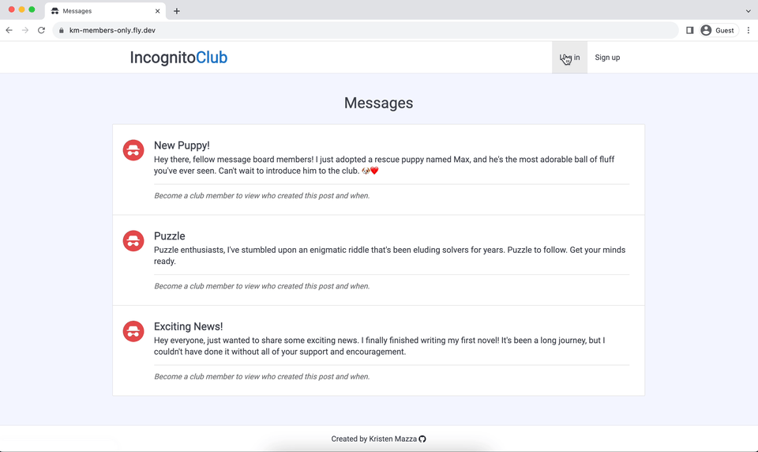

# Members Only: Incognito Club

Incognito Club is an exclusive clubhouse in which anyone can view the messages posted to the message board, but only logged-in members can see who wrote the messages and post new messages. To become a member, users must first sign up/log in and then gain membership by entering a secret password (see secret password below to try it out). Users can verify their membership status in their account dropdown. Members can also become administrators by entering an admin password. Administrators have the power to delete messages. This project was created to develop knowledge and skills in authentication and user permission management.

**Secret Password (case-sensitive):** `superSecretPassword` :key:

**[Live Demo](https://km-members-only.fly.dev/)** :point_left:



## Technologies Used

- [Node.js](https://nodejs.org/en)
- [Express.js](https://expressjs.com/)
- [MongoDB](https://www.mongodb.com/)
- [Passport.js](https://www.passportjs.org/) (user authentication)
- [bcryptjs](https://www.npmjs.com/package/bcryptjs) (password encryption)
- [EJS](https://ejs.co/) (templating language)
- [Fly.io](fly.io) (for deployment)

## Set Up

### Prerequisites

- This project uses MongoDB for the database. To learn how to set up the database, see the MongoDB [documentation](https://www.mongodb.com/docs/atlas/getting-started/).

### Cloning the Repository

```bash
# Clone this repository
$ git clone git@github.com:kristenmazza/members-only.git

# Go into the repository
$ cd members-only
```

### Setting up the Project

- Install dependencies using `npm install`
- Set up the environmental variables
  - Create a `.env` file, and add the following variables:
    - `MONGODB_URI`: Your MongoDB connection string
    - `SECRET`: Session secret string
    - `CLUB_PASSWORD`: The secret password for users to gain membership into the club
    - `ADMIN_PASSWORD`: The password for users to become administrators
- Use `npm run serverstart` to start dev server with automatic restarts upon change (using nodemon). Access in your browser at `localhost:3000/`.
